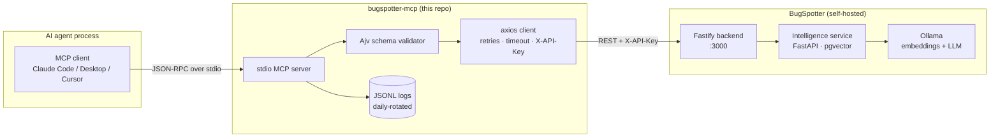

# bugspotter-mcp

An [MCP](https://modelcontextprotocol.io/) server that exposes 6 [BugSpotter](https://bugspotter.io/) operations to AI agents (Claude Code, Claude Desktop, Cursor, etc.).

**Two ways to run it:**

- **Stdio (per-user, self-hosted)** — the AI client spawns `bugspotter-mcp` as a subprocess; the API key lives in env. Standard MCP install path. Good for individuals and self-hosted teams.
- **HTTP (multi-tenant, hosted)** — one process serves many users; each request carries its own `Authorization: Bearer bgs_<key>`. Designed for teams behind a single hosted endpoint. New in v0.3.

Either way, no data leaves your network — the server speaks to your own BugSpotter instance and that's it.

## Architecture at a glance



Everything between the agent and Ollama runs on your network. The MCP server is the only piece this repo ships; BugSpotter and the intelligence service are existing components.

See [`docs/architecture.md`](docs/architecture.md) for component-by-component detail and design rationale.

## Tools

| Tool | What it does |
|---|---|
| `search_bugs` | Natural-language search across a project's bugs |
| `find_similar` | Find bugs similar to a given bug (embedding similarity) |
| `get_bug` | Fetch one bug's full details (description, console errors, network logs, stack trace, …) |
| `list_bugs` | Filtered list of bugs for triage / overview |
| `update_bug_status` | Update status / priority / resolution notes |
| `ask` | RAG-backed Q&A over the project's bugs |

## Install

Requires Node ≥ 20.

```bash
git clone https://github.com/apex-bridge/bugspotter-mcp.git
cd bugspotter-mcp
npm install
npm run build
```

Copy `.env.example` to `.env` and fill in your BugSpotter URL + API key.

## Environment variables

### Stdio mode (`bugspotter-mcp`)

| Var | Required | Notes |
|---|---|---|
| `BUGSPOTTER_BASE_URL` | yes | e.g. `http://localhost:3000`, `https://api.kz.bugspotter.io`, or your self-hosted URL |
| `BUGSPOTTER_API_KEY` | yes | Project-scoped key starting with `bgs_`. Needs `reports:read` + `reports:write` |
| `BUGSPOTTER_DEFAULT_PROJECT` | no | UUID; lets agents call `search_bugs` / `ask` without specifying `project_id` |
| `LOG_DIR` | no | Where JSONL behavioral logs go. Defaults to `./logs/` |

In stdio mode the API key is sent to BugSpotter in the `X-API-Key` header.

### HTTP mode (`bugspotter-mcp-http`)

| Var | Required | Notes |
|---|---|---|
| `BUGSPOTTER_BASE_URL` | yes | Same as above. The HTTP server itself is multi-tenant; this is the upstream URL it dispatches to. |
| `PORT` | no | Listening port. Default `8080`. |
| `LOG_DIR` | no | Same as above. |
| `MCP_SKIP_AUTH_VERIFY` | no | Set to `1` to skip the on-initialize auth probe against BugSpotter. Useful for tests against mock upstreams. |

In HTTP mode the per-tenant key is **not** in env — each MCP request carries `Authorization: Bearer bgs_<key>` and (optionally) `X-Project-ID: <uuid>`. The server hashes the key (`sha256(key)[:12]`) into the JSONL log; raw keys never persist.

## Run as a hosted service

Build the Docker image and deploy behind your TLS terminator (nginx, Caddy, Traefik, …):

```bash
docker build -t bugspotter-mcp .
docker run --rm -p 8080:8080 \
  -e BUGSPOTTER_BASE_URL=https://api.kz.bugspotter.io \
  -v /var/log/bugspotter-mcp:/var/log/bugspotter-mcp \
  bugspotter-mcp
```

Health check: `GET /health` (no auth). Endpoint: `POST /mcp` (with `Authorization: Bearer bgs_<key>`).

Sessions are bound to the auth that initialized them — presenting a known `Mcp-Session-Id` with a different Bearer is rejected with 403. Stale sessions are GC'd by an in-process sweeper (TTL = 30 min default).

## Connect from a client

### Claude Desktop

See [`examples/claude-desktop-config.json`](examples/claude-desktop-config.json). Drop the `mcpServers.bugspotter` block into:

- macOS: `~/Library/Application Support/Claude/claude_desktop_config.json`
- Windows: `%APPDATA%\Claude\claude_desktop_config.json`

Restart Claude Desktop. The 6 tools should appear in the tool picker.

### Cursor

See [`examples/cursor-config.json`](examples/cursor-config.json). Save as `.cursor/mcp.json` in your project (or `~/.cursor/mcp.json` for user-wide).

### Claude Code

```bash
claude mcp add bugspotter \
  --env BUGSPOTTER_BASE_URL=http://localhost:3000 \
  --env BUGSPOTTER_API_KEY=bgs_xxx \
  --env BUGSPOTTER_DEFAULT_PROJECT=<uuid> \
  -- node /absolute/path/to/bugspotter-mcp/dist/server.js
```

## BugSpotter test instance

Don't point this at production. Spin up a fresh local instance with synthetic bugs:

```bash
git clone https://github.com/apex-bridge/bugspotter-public.git
cd bugspotter-public
./dev.sh start
# In the admin UI (http://localhost:5173), create a project and an API key
# with reports:read + reports:write. Use that project's UUID as
# BUGSPOTTER_DEFAULT_PROJECT.
```

## Behavioral logs

Every tool call writes one line to `${LOG_DIR}/calls-YYYY-MM-DD.jsonl`. Schema:

```json
{
  "timestamp": "2026-05-06T12:34:56.789Z",
  "session_id": null,
  "agent_hint": "claude-desktop-0.7.x",
  "tool": "search_bugs",
  "args": { "query": "login broken", "limit": 10 },
  "args_size_bytes": 42,
  "result_status": "ok",
  "result_count": 5,
  "result_size_bytes": 1234,
  "duration_ms": 145,
  "error_class": null,
  "error_message": null,
  "upstream_url": "POST /api/v1/intelligence/projects/abc/search"
}
```

For `search_bugs` and `ask`, free-text fields are PII-scrubbed before being written (emails, credit cards, JWTs).

## Tests

```bash
npm test                # full suite
npm run test:unit       # tool schemas + PII redaction (no BugSpotter needed)
npm run test:integration # end-to-end against an in-process mock server
```

## Documentation

- [`docs/architecture.md`](docs/architecture.md) — components, request lifecycle, design decisions
- [`docs/use-cases.md`](docs/use-cases.md) — concrete agent workflows: triage, dedup, postmortem Q&A, …
- [`docs/behavioral-logs.md`](docs/behavioral-logs.md) — log schema + analysis recipes (`jq` queries)
- [`docs/troubleshooting.md`](docs/troubleshooting.md) — common errors and how to fix them

## License

MIT — see [LICENSE](LICENSE).
