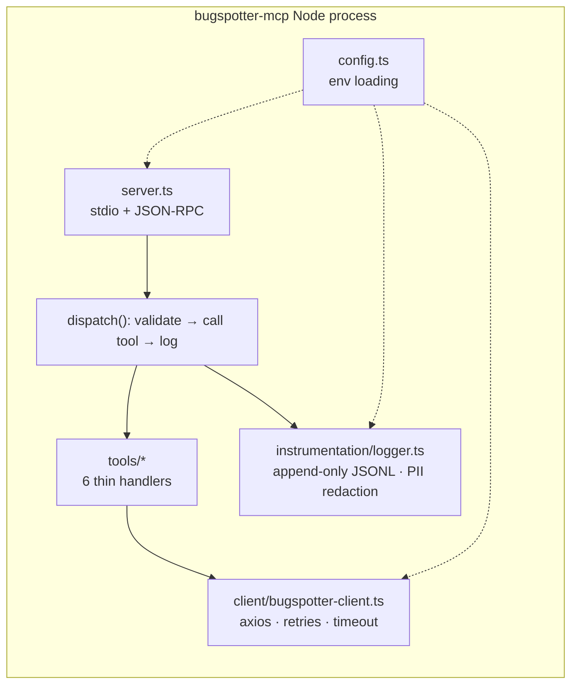
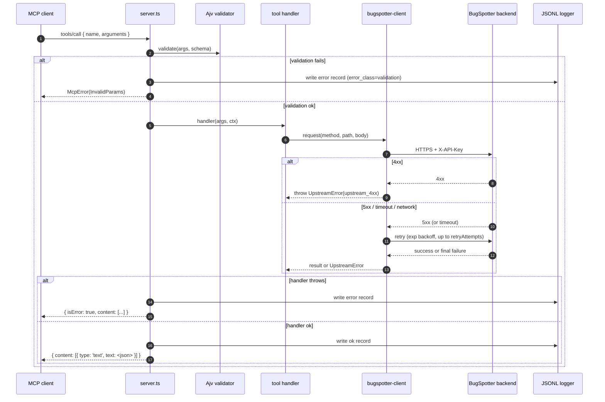

# Architecture

`bugspotter-mcp` is a thin protocol-translation adapter. It speaks MCP to the agent on one side, REST to BugSpotter on the other, and writes a structured behavioral log of every call in between.

This doc walks through the components, the request lifecycle, and the design decisions that shaped the code.

---

## Components



| File | Responsibility |
|---|---|
| [`src/server.ts`](../src/server.ts) | MCP entry point. Registers tool list, dispatches `tools/call`, owns the validation + logging wrapper. |
| [`src/tools/*.ts`](../src/tools/) | One file per tool. Each exports a `name`, `description`, `inputSchema`, and an `async handler(args, ctx)`. No transport-aware code. |
| [`src/client/bugspotter-client.ts`](../src/client/bugspotter-client.ts) | The single place HTTP happens. Handles `X-API-Key` header, retry policy, error classification. |
| [`src/instrumentation/logger.ts`](../src/instrumentation/logger.ts) | Daily-rotated JSONL writer + PII regex redactor. |
| [`src/config.ts`](../src/config.ts) | Reads `.env`, validates required vars, applies defaults. |
| [`src/types.ts`](../src/types.ts) | Shared types: `ToolDefinition`, `ToolContext`, `ToolResult`, `UpstreamError`. |

---

## Request lifecycle



Key invariant: **every dispatch writes exactly one log line**, whether validation rejects, the upstream returns an error, or the tool succeeds.

---

## Tool → endpoint mapping

The 6 tools are deliberately narrow. Each is a 1:1 wrap of one BugSpotter endpoint, with the tool's argument schema chosen for ergonomics — not for upstream fidelity.

| Tool | HTTP | BugSpotter endpoint | Notes |
|---|---|---|---|
| `search_bugs` | POST | `/api/v1/intelligence/projects/:projectId/search` | Body: `{ query, mode, limit }`. `mode=fast` is vector-only; `mode=smart` adds LLM rerank. |
| `find_similar` | GET | `/api/v1/intelligence/projects/:projectId/bugs/:id/similar` | `threshold` and `limit` go in the query string. |
| `get_bug` | GET | `/api/v1/reports/:id` | Returns title, description, console errors, network logs, stack trace, status, priority, timestamps. |
| `list_bugs` | GET | `/api/v1/reports?…` | Tool exposes `from_date`/`to_date` for ergonomics; client translates to upstream `created_after`/`created_before`. |
| `update_bug_status` | PATCH | `/api/v1/reports/:id` | Tool's `note` field is renamed to `resolution_notes` in the PATCH body. |
| `ask` | POST | `/api/v1/intelligence/projects/:projectId/ask` | Body: `{ question, context?, temperature?, max_tokens? }`. RAG retrieval is server-side; `context` is *additional* free-text. |

For why these specific 6 tools (and not a `create_bug` or `add_comment`), see [Design decisions](#design-decisions) below.

---

## Auth

The API key is sent in the `X-API-Key` header. The `Authorization: Bearer …` header is **not used** — BugSpotter reserves it for dashboard-user JWTs.

```
X-API-Key: bgs_<key>
```

Required permissions on the key:

- `reports:read` — needed by `get_bug`, `list_bugs`, `search_bugs`, `find_similar`, `ask`
- `reports:write` — needed by `update_bug_status`

Plus the project must be in `allowed_projects[]` on the key. A self-service-signup ingest-only key (which BugSpotter issues with no read scope) will be rejected on every read tool.

See [bugspotter-public's auth model](https://github.com/apex-bridge/bugspotter-public/blob/main/packages/backend/docs/auth.md) for the full RBAC story.

---

## Configuration

All config flows through env vars (loaded at startup via `dotenv`):

| Var | Required | Default | Used by |
|---|---|---|---|
| `BUGSPOTTER_BASE_URL` | yes | — | client base URL |
| `BUGSPOTTER_API_KEY` | yes | — | `X-API-Key` header |
| `BUGSPOTTER_DEFAULT_PROJECT` | no | — | fallback project_id for `search_bugs`, `find_similar`, `list_bugs`, `ask` |
| `LOG_DIR` | no | `./logs` | where JSONL logs are written |

Hardcoded constants (in `config.ts`):

- HTTP timeout: 10 s
- Retry attempts: 3
- Retry backoff: 250 ms · 500 ms · 1 s (exponential)
- Retry policy: 5xx, timeout, network — never 4xx

---

## Design decisions

### Why exactly 6 tools?

Bug-tracker MCP servers don't exist (Smithery + Anthropic catalogs audited 2026-04). There's no precedent for what surface to expose. The 6 here are chosen by frequency in human triage flow:

1. `search_bugs` + `find_similar` + `ask` — **discovery** (the most common reason an agent looks at a tracker)
2. `get_bug` + `list_bugs` — **inspection** (drill-in once you've found something)
3. `update_bug_status` — **the one write** an agent should reasonably do unattended

Notable omissions (`create_bug`, `add_comment`, `attach_session_replay`, `suggest_fix`):

- `create_bug` — agents auto-filing bugs is high-blast-radius; explicit human gate first.
- `add_comment` — BugSpotter has no comments table yet (as of 2026-04). Adding the tool would force a backend change.
- `attach_session_replay` — needs presigned-URL handling; doesn't fit one MCP tool call.
- `suggest_fix` (mitigation) — uses an async polling pattern (POST → job → GET cache). Doesn't map to one synchronous tool call cleanly.

### Why JSON Schema + Ajv (not Zod)?

The MCP spec says tools' `inputSchema` is JSON Schema. Validating with Ajv keeps the same definition that the agent sees over the wire. Zod would force a separate source of truth (Zod schema in code, JSON Schema on the wire) and risk drift.

### Why one tool file per tool?

The brief specified the layout, and it pays off:
- Each tool's argument shape, schema, and handler live together. Reading one file gives you the full contract.
- The dispatch layer ([`server.ts`](../src/server.ts)) stays free of tool-specific logic — it just iterates `TOOLS` and validates / dispatches.
- Adding a 7th tool is one new file + one line in [`src/tools/index.ts`](../src/tools/index.ts).

### Why log every call as JSONL?

This server doubles as a **research artifact**: behavioral logs from agents using it become the data for an article on how AI agents reason about bug-tracker state. JSONL is:

- Append-only (no concurrency hazard with multiple stdio servers writing in parallel under SaaS deployments).
- Flat per-line — a single `jq -c` pipeline can aggregate without parsing nested structures.
- Daily-rotated, so the file size stays bounded and you can scope analyses by date.

See [`behavioral-logs.md`](behavioral-logs.md) for the schema and analysis recipes.

### Why redact PII *only* on `search_bugs` and `ask`?

These two tools have **free-text** primary args (`query`, `question`) — they're the only place a user is likely to paste an email or token. Other tools take UUIDs and enums where PII would be a category error.

Redaction is single-pass regex: emails, JWT-shaped tokens, and credit-card-shaped digit runs. It's not bulletproof — the goal is to avoid logging obvious leaks, not to be a DLP layer.

### Why `null` for `result_count` instead of `undefined` or `0`?

`null` distinguishes "this tool returned a list and the list was empty" (`0`) from "this tool's response shape doesn't have a meaningful count" (`null`, e.g. `update_bug_status`). `undefined` would JSON-serialize away and hurt downstream `jq` aggregations.

### Why retry 5xx but never 4xx?

A 4xx is a contract failure — the call is wrong, retrying won't help. A 5xx, timeout, or network error is a transient failure where the upstream might recover. The retry policy errs on the side of *not* hammering the upstream when the client is at fault.
