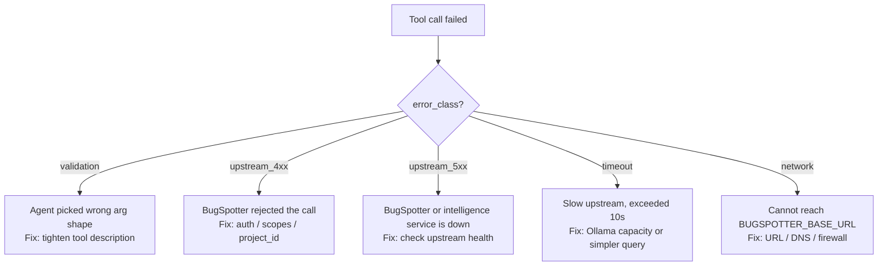

# Troubleshooting

If a tool call fails, the first place to look is the JSONL log line for that call. Every error has an `error_class` and an `error_message` that pins down which layer broke.



The sections below map each class to its fix.

---

## Startup errors

### `Error: BUGSPOTTER_BASE_URL is required`

The server couldn't find the env var. Either:

- `.env` file is in the wrong directory — the server reads from CWD.
- Running under a launcher (Claude Desktop, Cursor) that doesn't inherit shell env. **Solution:** put env vars in the `env` block of the launcher's MCP config, not in your shell profile. See [`examples/claude-desktop-config.json`](../examples/claude-desktop-config.json).

### `Error: BUGSPOTTER_API_KEY must start with "bgs_"`

You pasted a JWT or a placeholder. BugSpotter API keys always begin with `bgs_`. Generate one in the admin UI under *Settings → API Keys* with the `reports:read` + `reports:write` permissions.

### Server starts but immediately exits

Run it directly to see the failure:

```bash
node dist/server.js
```

If it dies with `Cannot find module '@modelcontextprotocol/sdk/...'` you forgot to `npm install` and `npm run build`. The `dist/` directory only exists after a build.

---

## `error_class: "validation"`

The agent sent arguments that don't match the tool's JSON Schema.

**Common cases:**

| Symptom in `error_message` | Likely cause |
|---|---|
| `must have required property 'bug_id'` | Tool needs an ID and the agent didn't supply one. |
| `must be equal to one of the allowed values` | Agent invented a status (e.g. `"wontfix"`) — the enum is `open`, `in-progress`, `resolved`, `closed`. |
| `must NOT have additional properties` | Agent passed an unknown field. The schemas use `additionalProperties: false` — typos like `bugid` instead of `bug_id` get rejected. |
| `must match format "date"` | `from_date`/`to_date` need ISO `YYYY-MM-DD`, not natural language. |

**Fix:** the tool descriptions should be unambiguous enough that the agent picks the right shape. If you see the same validation failure repeatedly across runs, edit the tool's `description` to call out the constraint explicitly, then rebuild.

---

## `error_class: "upstream_4xx"`

BugSpotter received the request but rejected it. Look at the actual status in `error_message`:

### `BugSpotter 401: ...`

The API key is missing, malformed, or the request is hitting an endpoint that requires JWT (dashboard) auth.

- Confirm `BUGSPOTTER_API_KEY` starts with `bgs_`.
- Confirm the BugSpotter you're hitting actually accepts API keys for that endpoint. Intelligence endpoints accept either user JWT or API key; reports endpoints accept either; admin endpoints don't.

### `BugSpotter 403: ...`

The key authenticated but lacks permission. Two flavors:

- **Permission scope:** the key has `reports:read` but not `reports:write` and you tried `update_bug_status`.
- **Project access:** the key's `allowed_projects[]` doesn't include the project_id the tool is calling. Check the tool args — is `project_id` (or `BUGSPOTTER_DEFAULT_PROJECT`) actually in the key's allowlist?

### `BugSpotter 404: ...`

For `get_bug` / `update_bug_status`: the bug ID doesn't exist (or isn't in a project the key can see).

For `find_similar`: the bug exists but has no embedding yet — embeddings are generated asynchronously after a bug is filed. Wait a minute and retry.

### `BugSpotter 422: ...` / validation errors from upstream

The upstream's own schema rejected the body. This usually means the MCP server's argument-translation layer is out of sync with the backend. Open an issue and include the log line.

### `BugSpotter 429: rate limit exceeded`

The agent is hammering the API. The MCP server doesn't add its own rate limiter — the upstream's enforcement is intentional. Either:

- Slow the agent down (one of the reasons to log behavioral data — spot the patterns).
- Bump the upstream's rate-limit config if you're self-hosted and confident the load is legitimate.

---

## `error_class: "upstream_5xx"`

BugSpotter accepted the request but failed to serve it. The MCP server retries (3 attempts, exponential backoff) before giving up; if you're seeing 5xx in the logs, all retries exhausted.

**Diagnostic order:**

1. **Hit the BugSpotter health endpoint directly:**
   ```bash
   curl -i $BUGSPOTTER_BASE_URL/api/v1/intelligence/health \
     -H "X-API-Key: $BUGSPOTTER_API_KEY"
   ```
   If this also returns 5xx, the problem is upstream — see BugSpotter's own logs.

2. **For `search_bugs` / `find_similar` / `ask` failing with 5xx but other tools fine:** the intelligence service (FastAPI + pgvector + Ollama) is down. Check `bugspotter-intelligence` container logs.

3. **For all tools failing with 5xx:** the Fastify backend is down. Check `bugspotter-backend` container logs and Postgres health.

4. **If you have [Dozzle](https://dozzle.dev/) running:** `http://localhost:9999` shows live container logs across the stack.

---

## `error_class: "timeout"`

A single request exceeded the 10-second client timeout. The server retries on timeout, so seeing this in the final log means three timeouts in a row.

**Most common cause:** `mode: "smart"` on `search_bugs`, or any `ask` call, when Ollama is under-resourced. The LLM rerank / generation step is the slow part, not the MCP server itself.

**Fix priorities:**

1. Check Ollama: `curl localhost:11434/api/tags`. Slow response → CPU contention or model evicted from RAM.
2. Use `mode: "fast"` to skip the LLM rerank.
3. As a last resort, raise `timeoutMs` in [`src/config.ts`](../src/config.ts) (currently hardcoded at 10 s). This is a code change, not a config knob, on purpose — long timeouts hide the real problem.

---

## `error_class: "network"`

The HTTP client never reached BugSpotter. Causes, in order of likelihood:

| Symptom | Fix |
|---|---|
| `getaddrinfo ENOTFOUND` | DNS issue — verify `BUGSPOTTER_BASE_URL` is resolvable from this machine. |
| `connect ECONNREFUSED` | BugSpotter isn't running on that host/port. For local dev, did `./dev.sh start` succeed? |
| `connect ETIMEDOUT` | Firewall or VPN blocking. Try `curl $BUGSPOTTER_BASE_URL/health`. |
| `socket hang up` | Reverse proxy (nginx, Traefik) terminated the connection. Check proxy logs. |

---

## "The agent says the server isn't connected"

If the MCP client (Claude Code, Cursor, etc.) reports the server as failed-to-start:

1. **Check the client's MCP server log.** Most clients capture stderr from the spawned server process. For Claude Desktop on macOS, that's `~/Library/Logs/Claude/mcp*.log`.
2. **Run the server manually with the same env:** if it dies in your terminal, it'll die in the client too. The error message in stderr is your clue.
3. **Path issues:** the `command`/`args` in the client config must be **absolute paths**. Relative paths break depending on the client's working directory.
4. **Build artifacts missing:** the `dist/` directory must exist. After `git pull`, always re-run `npm run build`.

---

## Logs aren't being written

- Check `LOG_DIR` is writable by the user running the server. The directory is created on first write (`mkdir -p` semantics), so the parent has to exist or be creatable.
- A failed `fs.appendFile` swallows silently inside dispatch — the tool call still returns to the agent. If you suspect this, add a try/catch in [`src/instrumentation/logger.ts`](../src/instrumentation/logger.ts) that re-throws or writes to stderr.
- Disk full? `df -h $LOG_DIR`. JSONL files grow unbounded within a day; rotate / archive nightly if your volume is small.
