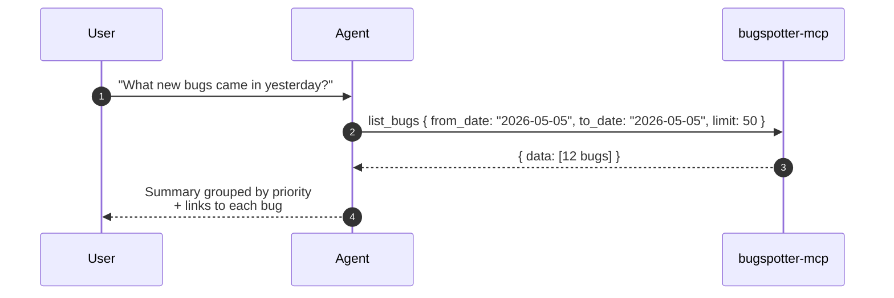
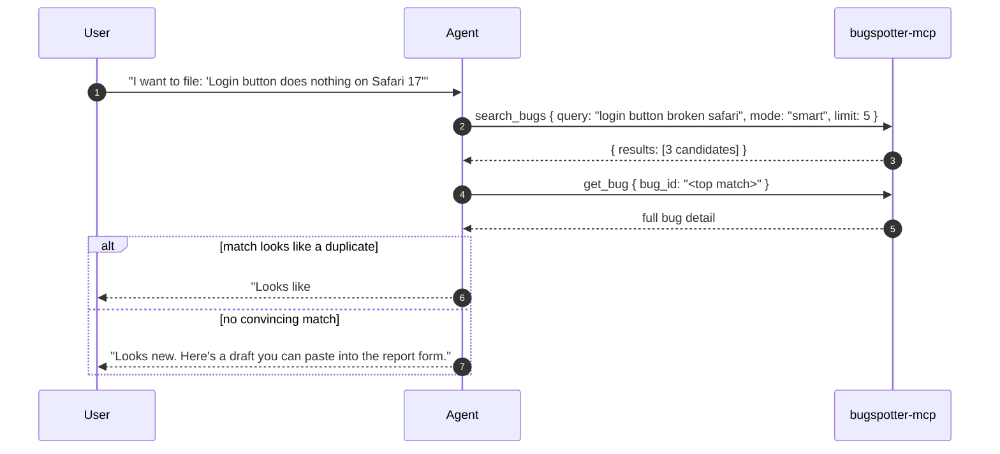
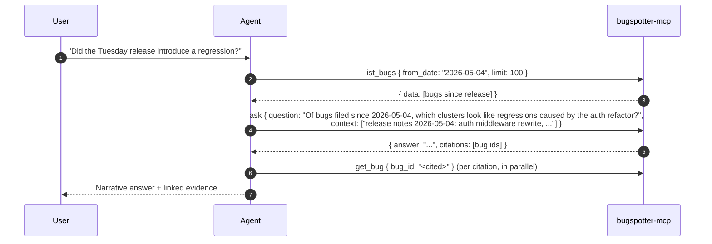
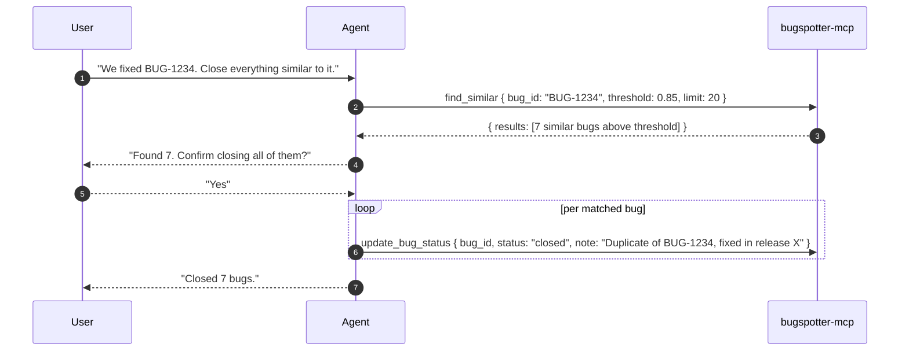
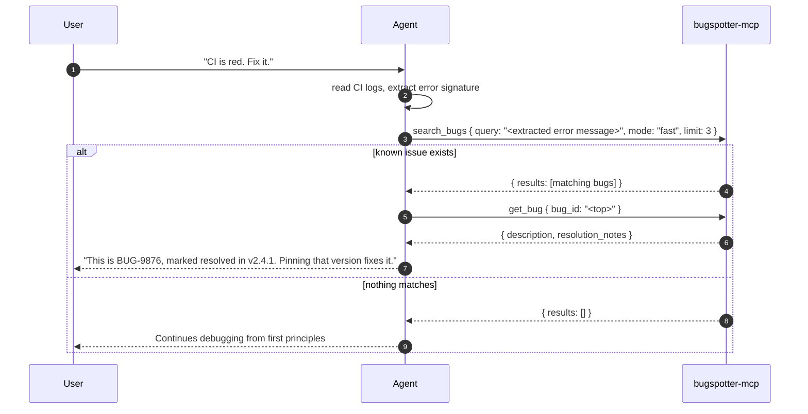

# Use cases

Five concrete workflows for an AI agent connected to `bugspotter-mcp`. Each shows the user prompt, the tool sequence the agent typically picks, and a sequence diagram. Sample tool calls use the actual MCP `tools/call` shape.

---

## 1. Triage: "What landed in the bug tracker yesterday?"

A daily standup question. The agent should bias toward `list_bugs` over `search_bugs` because the user is asking by *time*, not *content*.



Sample call:

```json
{ "name": "list_bugs",
  "arguments": { "from_date": "2026-05-05", "to_date": "2026-05-05", "status": "open", "limit": 50 } }
```

Why not `search_bugs`? Because semantic search ranks by similarity; it would surface old bugs that *sound like* yesterday's reports. `list_bugs` is filtered by the actual `created_at` column.

---

## 2. Dedup before filing a new bug

The user is about to file a bug. The agent should check if a similar one already exists before creating a duplicate.



Sample call sequence:

```json
{ "name": "search_bugs",
  "arguments": { "query": "login button does nothing safari 17", "mode": "smart", "limit": 5 } }
```

```json
{ "name": "get_bug",
  "arguments": { "bug_id": "9b2d…" } }
```

Why `mode: "smart"`? The user's wording ("does nothing") may not lexically match the existing bug's wording ("button is unresponsive"). LLM rerank pulls semantic matches that pure-vector similarity often misses.

Why follow up with `get_bug`? Search results include a short excerpt; deciding "duplicate vs. new" needs the full description, console errors, and stack trace.

---

## 3. Postmortem: "Did we ship a regression in the Tuesday release?"

The user wants to spot-check whether bugs spiked in a window. This is `ask` territory — the question requires reasoning across multiple bugs, not just a list.



Why not just `ask` directly? The agent needs to scope the RAG window — feeding *all* historical bugs would dilute the analysis. A `list_bugs` with the date filter narrows the candidate set, then `ask` reasons over relevant ones (the intelligence service does its own retrieval, but knowing the time window helps the agent ground the question).

The `context` field on `ask` is the right place to inject release notes or feature-flag context the bug DB doesn't know about.

---

## 4. "Close everything that looks like the auth-token bug we fixed"

A semi-automated cleanup. The agent uses `find_similar` against a reference bug, lets the user confirm, then bulk-resolves. This is the **only** flow where `update_bug_status` is appropriate without an explicit user instruction *per bug*.



Sample resolution call:

```json
{ "name": "update_bug_status",
  "arguments": {
    "bug_id": "abc-123",
    "status": "closed",
    "note": "Duplicate of BUG-1234, fixed in release 2026.05.04 (auth middleware rewrite)."
  } }
```

Threshold is the safety knob. `0.85` keeps recall conservative; `0.7` (default) would catch more loosely related bugs but increase false-positive closes. Tune up, not down.

---

## 5. Self-debugging: "Why is the build failing in CI?"

An agent debugging *its own user's* code. It pulls in BugSpotter context to check whether the failure mode is already a known issue.



Why `mode: "fast"` here? The error string from CI is usually distinctive enough that vector similarity alone produces high-precision matches. `smart` mode adds latency that's not worth it inside a debugging hot loop.

---

## Anti-patterns

Patterns the agent should **not** fall into:

- **Calling `update_bug_status` without explicit user confirmation.** It's the one write tool. Default to "ask first."
- **Using `search_bugs` for time-bounded queries.** Use `list_bugs` with `from_date`/`to_date`. Search is for content; list is for filters.
- **Calling `get_bug` for every result of `search_bugs` upfront.** Search returns excerpts; only drill in when you need full detail. Logs from over-eager `get_bug` chains will show up as low-`result_count`-per-call patterns and inflate cost.
- **Looping `find_similar` on every list element.** If you're trying to find duplicate clusters across many bugs, that's not a 6-tool job — escalate to a one-off batch script.
- **Asking `ask` open-ended product-strategy questions.** It's RAG-grounded in the bug DB. "Why are users frustrated?" → use product analytics. "What bugs cluster around feature X?" → that's `ask`'s sweet spot.
